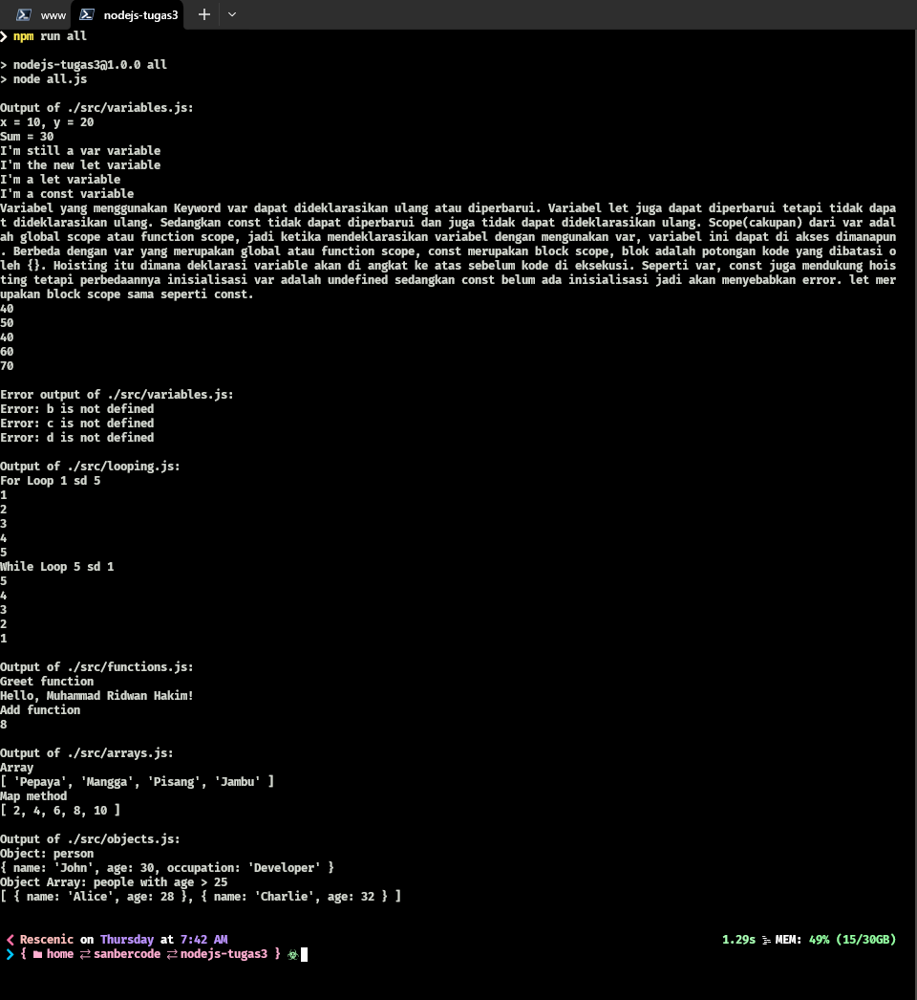

# Tugas 3 Sanbercode Node.JS Backend

## Muhammad Ridwan Hakim

### Deploy Localhost

```bash
git clone https://github.com/rescenic/nodejs-tugas3.git

npm install

npm run variables
npm run looping
npm run functions
npm run arrays
npm run objects
npm run all

```

### Screenshots


